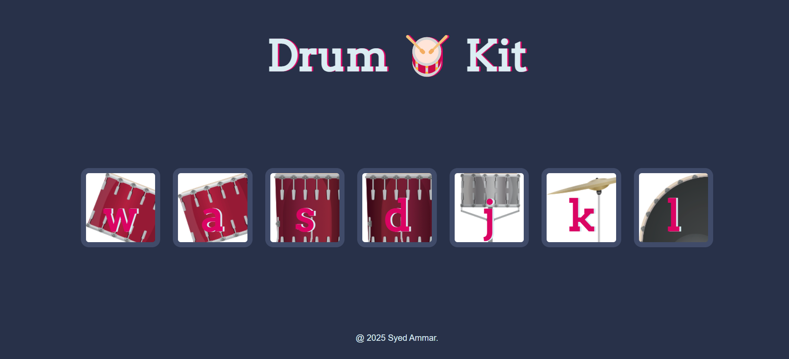

# 🥁 Drum Kit - Web Project

This is a fun and interactive Drum Kit built using **HTML**, **CSS**, and **JavaScript**. Each key on your keyboard corresponds to a unique drum sound with visual feedback on press or click. 

---

## 📸 Screenshot

---

## 📁 Folder Structure
drum-kit/
├── index.html
├── style.css 
├── script.js 
└── sounds/ 
├── crash.mp3
├── kick-bass.mp3
├── snare.mp3
├── tom-1.mp3
├── tom-2.mp3
├── tom-3.mp3
└── tom-4.mp3

---

## ⚙️ How It Works

- **Click** on the buttons or **press** keys (`W`, `A`, `S`, `D`, `J`, `K`, `L`) to play drum sounds.
- Visual feedback is given using CSS animations.
- All audio files are stored locally under the `sounds/` folder.

---

## 🚀 Tech Stack

- **HTML5** – Structure
- **CSS3** – Styling and effects
- **JavaScript** – Logic and interactivity

## 🧠 Inspiration
- This project is inspired by beginner-friendly JavaScript projects to strengthen DOM manipulation and event handling skills.
- Feel free to fork, enhance, or add new sounds or animations! Pull requests are welcome.
---

